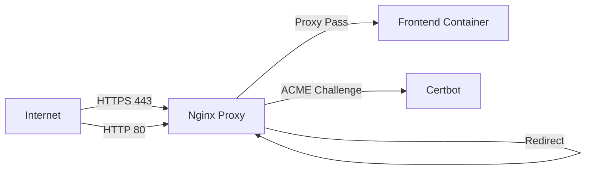

# Technical Architecture Document

## System Overview

The Sharp Horizons Website Generator is a modern web application built with a focus on performance, security, and scalability. This document outlines the technical architecture and design decisions.

## Architecture Components

### 1. Frontend Architecture

#### Technology Stack
- **Framework**: Next.js 14
- **Language**: TypeScript
- **Styling**: Tailwind CSS
- **Animations**: Framer Motion
- **State Management**: React Context/Hooks
- **Build Tool**: Webpack (via Next.js)

#### Key Features
- Server-Side Rendering (SSR)
- Static Site Generation (SSG)
- Image Optimization
- Route Pre-fetching
- Code Splitting
- TypeScript Type Safety

### 2. Infrastructure Architecture

#### Cloud Provider: Azure
- **DNS**: Azure DNS
- **Storage**: Azure Blob Storage
- **Monitoring**: Azure Monitor
- **Security**: Azure Key Vault

#### Container Architecture
- **Runtime**: Docker
- **Orchestration**: Docker Compose
- **Base Images**:
  - Frontend: node:20-alpine
  - Nginx: nginx:1.25-alpine
  - Certbot: certbot/certbot

#### Network Architecture


### 3. CI/CD Pipeline

#### Components
- **Source Control**: GitHub
- **CI/CD Platform**: GitHub Actions
- **Container Registry**: Docker Hub
- **Infrastructure as Code**: Terraform
- **Configuration Management**: Environment Variables

#### Pipeline Stages
1. **Build Stage**
   - Code Checkout
   - Dependency Installation
   - Type Checking
   - Linting
   - Unit Testing
   - Docker Image Building

2. **Test Stage**
   - Integration Tests
   - E2E Tests
   - Security Scans
   - Performance Tests

3. **Deploy Stage**
   - Infrastructure Updates
   - Container Deployment
   - Health Checks
   - DNS Updates

### 4. Security Architecture

#### SSL/TLS Configuration
- Automatic certificate management via Let's Encrypt
- HTTPS enforcement
- HSTS implementation
- Modern cipher suites

#### Security Headers
```nginx
add_header Strict-Transport-Security "max-age=31536000; includeSubDomains" always;
add_header X-Frame-Options "SAMEORIGIN" always;
add_header X-XSS-Protection "1; mode=block" always;
add_header X-Content-Type-Options "nosniff" always;
add_header Referrer-Policy "strict-origin-when-cross-origin" always;
add_header Content-Security-Policy "default-src 'self';" always;
```

#### Access Control
- Azure RBAC
- Network Security Groups
- Container isolation
- Least privilege principle

### 5. Monitoring Architecture

#### Metrics Collection
- Container health
- Application performance
- Resource utilization
- Error rates
- Response times

#### Logging
- Structured JSON logging
- Centralized log aggregation
- Log retention policies
- Audit logging

#### Alerting
- Performance thresholds
- Error rate thresholds
- SSL certificate expiration
- Infrastructure health

## Scalability Considerations

### Horizontal Scaling
- Containerized architecture
- Stateless application design
- Load balancer ready
- Session management via Redis (planned)

### Performance Optimization
- CDN integration (planned)
- Browser caching
- Response compression
- Image optimization
- Code splitting

## Disaster Recovery

### Backup Strategy
- Infrastructure state backups
- Database backups (planned)
- Container image versioning
- Configuration backups

### Recovery Procedures
1. Infrastructure recreation via Terraform
2. DNS restoration
3. Container redeployment
4. SSL certificate renewal
5. Data restoration (if applicable)

## Future Enhancements

### Phase 1: Performance
- [ ] CDN Integration
- [ ] Redis Caching
- [ ] Image Optimization Service
- [ ] API Response Caching

### Phase 2: Scalability
- [ ] Kubernetes Migration
- [ ] Multi-region Deployment
- [ ] Load Balancing
- [ ] Auto-scaling

### Phase 3: Monitoring
- [ ] APM Integration
- [ ] Real-user Monitoring
- [ ] Custom Metrics
- [ ] Advanced Alerting

### Phase 4: Security
- [ ] WAF Integration
- [ ] DDoS Protection
- [ ] Security Information and Event Management (SIEM)
- [ ] Automated Security Testing

## Appendix

### A. Network Ports
- 80: HTTP
- 443: HTTPS
- 3000: Frontend Development
- 3001: Frontend Production

### B. Resource Requirements
- CPU: 2 cores minimum
- RAM: 4GB minimum
- Storage: 20GB minimum
- Network: 100Mbps minimum

### C. Dependencies
- Node.js 20.x
- Docker 24.x
- Docker Compose 2.x
- Terraform 1.5+
- Azure CLI 2.50+